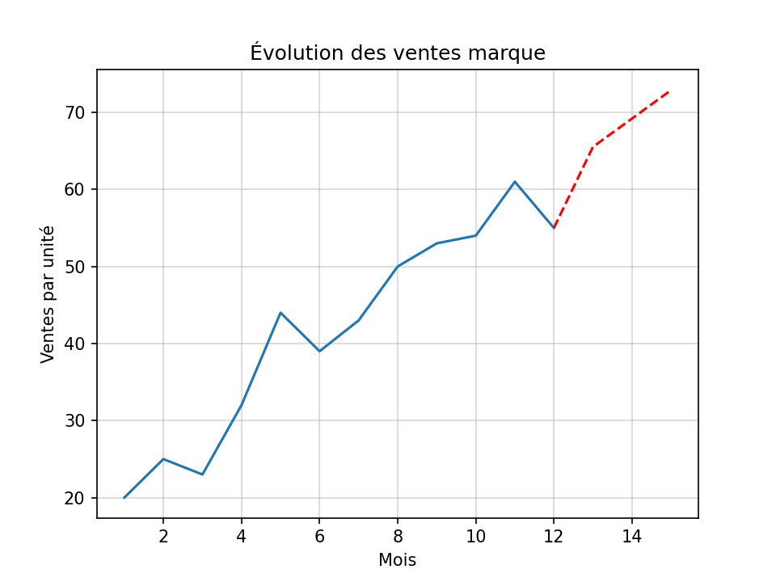

# Fictional Sales Forecast – Clothing Brand

A fictional sales analysis of a clothing brand over one year, with a three-month forecast.

## What it does
- Computes basic statistics (mean, min, max, growth)
- Builds a linear regression to forecast the next 3 months
- Visualizes real sales vs predictions with Matplotlib

## Libraries used
- NumPy
- Matplotlib

## Preview

plt.show()
